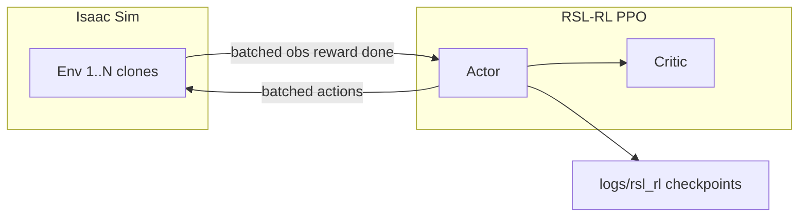

# Environment setup (Windows + Isaac Lab)

Complete one-time setup for GPU-parallel RL on this machine. Isaac Gym is **not** used; training runs through **Isaac Sim 5.1** and **Isaac Lab** with **RSL-RL (PPO)**.

**If pip fails with `WinError 206` (path too long):** use the short-path layout in **[WINDOWS_LONG_PATH.md](WINDOWS_LONG_PATH.md)** and run `scripts\install_isaacsim_short.bat` + `scripts\clone_isaaclab_short.bat`.

**Official references:**

- [Isaac Lab — pip installation](https://isaac-sim.github.io/IsaacLab/main/source/setup/installation/pip_installation.html)
- [Isaac Lab — quickstart](https://isaac-sim.github.io/IsaacLab/main/source/setup/quickstart.html)
- [Available environments](https://isaac-sim.github.io/IsaacLab/main/source/overview/environments.html)

---

## Step 0 — Prerequisites checklist

| Requirement | Notes |
|-------------|--------|
| Windows 11 x64 | Supported for pip install |
| NVIDIA driver | Run `nvidia-smi`; CUDA driver must be recent (Isaac Sim 5.x docs recommend ~580+ on Windows) |
| Python **3.11** | Isaac Sim 5.x **does not** use Python 3.14. Use a dedicated 3.11 venv |
| Disk space | Isaac Sim pip package + assets: plan for **tens of GB** |
| Long paths | Enable Windows long path support (Step 1) |

---

## Step 1 — Enable long paths (Windows)

Long Omniverse/Isaac paths often exceed the legacy 260-character limit.

1. Open **Group Policy**: `Win + R` → `gpedit.msc`  
   Or enable via Registry / Windows Settings “LongPathsEnabled”.
2. **Computer Configuration → Administrative Templates → System → Filesystem → Enable Win32 long paths** → **Enabled**.

Alternatively (admin PowerShell):

```powershell
New-ItemProperty -Path "HKLM:\SYSTEM\CurrentControlSet\Control\FileSystem" -Name "LongPathsEnabled" -Value 1 -PropertyType DWORD -Force
```

Reboot if installers still fail with path errors.

---

## Step 2 — Install Python 3.11

If `py -0p` only shows 3.14, install 3.11:

```powershell
winget install Python.Python.3.11 --accept-package-agreements --accept-source-agreements
```

Verify:

```powershell
py -3.11 --version
```

---

## Step 3 — Create virtual environment

**Recommended:** use the short path `C:\Isaac\env_isaaclab` (see [WINDOWS_LONG_PATH.md](WINDOWS_LONG_PATH.md)).

```bat
scripts\install_isaacsim_short.bat
```

This creates the venv, installs PyTorch 2.7 + Isaac Sim 5.1, and sets up the stack under `C:\Isaac\`.

**EULA (non-interactive):** all project batch scripts set `OMNI_KIT_ACCEPT_EULA=YES`. For manual runs:

```powershell
$env:OMNI_KIT_ACCEPT_EULA = "YES"
```

Legacy Desktop venv (may hit WinError 206):

```powershell
cd "c:\Users\jkay5\Desktop\Robotics\NVIDIA Isaac Lab"
py -3.11 -m venv env_isaaclab
.\env_isaaclab\Scripts\Activate.ps1
python -m pip install --upgrade pip setuptools
```

---

## Step 4 — Install PyTorch (CUDA) and Isaac Sim 5.1

With the venv **activated**:

```powershell
pip install -U torch==2.7.0 torchvision==0.22.0 --index-url https://download.pytorch.org/whl/cu128
pip install "isaacsim[all,extscache]==5.1.0" --extra-index-url https://pypi.nvidia.com
```

This download is large and may take a long time. If it fails:

- Confirm long paths (Step 1)
- Retry with a stable network
- See [Isaac Sim forums](https://forums.developer.nvidia.com/c/omniverse/simulation/69) for pip-specific errors

Optional helper:

```bat
scripts\install_isaacsim.bat
```

---

## Step 5 — Clone Isaac Lab

**Version pin:** use **`v2.3.2`** with **Isaac Sim 5.1** and **Python 3.11**. The `main` branch targets newer Isaac Sim / Python 3.12 and will fail on this stack.

From workspace root:

```powershell
scripts\clone_isaaclab_short.bat
```

Target path: `C:\Isaac\IsaacLab`

---

## Step 6 — Install Isaac Lab extensions

**Windows pip workflow (recommended here):**

```bat
scripts\install_isaaclab_manual.bat
```

This installs editable packages from `C:\Isaac\IsaacLab\source\` and `rsl-rl-lib`, working around `flatdict==4.0.1` build issues (uses `flatdict==4.1.0` for core).

Upstream installer (may fail on Windows pip — empty `python_exe` in `isaaclab.bat`):

```bat
scripts\install_isaaclab.bat
```

Training scripts use `run_isaaclab_py.bat` (venv + `OMNI_KIT_ACCEPT_EULA=YES`) instead of `isaaclab.bat -p`.

**If training crashes on `tensordict` or torch/numpy versions drift:**

```bat
scripts\repair_venv.bat
```

---

## Step 7 — Verify installation

From workspace root (venv activated):

```bat
scripts\list_envs.bat
scripts\smoke_test.bat 16
```

Expected:

- `list_envs.bat` prints a table of `Isaac-*` Gymnasium task IDs
- `smoke_test.bat` runs parallel Cartpole rollouts without crashing

If smoke test OOMs, reduce env count: `scripts\smoke_test.bat 8`

---

## Step 8 — Train policies (GPU-parallel)

Edit [`config/training_defaults.env`](../config/training_defaults.env) if you need different `num_envs` or iteration counts.

### Locomotion (ANYmal-C, flat velocity tracking)

```bat
scripts\train_locomotion.bat
```

Task ID: `Isaac-Velocity-Flat-Anymal-C-v0`

Checkpoints and configs:

`IsaacLab\logs\rsl_rl\<experiment>\<timestamp>\`

### Manipulation (Franka reach)

```bat
scripts\train_manipulation.bat
```

Task ID: `Isaac-Reach-Franka-v0`

---

## Step 9 — Evaluate trained policies

Pass the path to a `.pt` checkpoint (relative to `IsaacLab` or absolute):

```bat
scripts\play_locomotion.bat IsaacLab\logs\rsl_rl\...\model_1500.pt
scripts\play_manipulation.bat IsaacLab\logs\rsl_rl\...\model_1000.pt
```

Omit `--headless` in play scripts by passing extra args if you want the viewport, e.g. add `--enable_cameras` only when needed for camera tasks.

Play task IDs use the `-Play-v0` variants (see `training_defaults.env`).

---

## VRAM tuning (8 GB GPU)

| Symptom | Action |
|---------|--------|
| CUDA OOM during train | Lower `LOCOMOTION_NUM_ENVS` / `MANIPULATION_NUM_ENVS` in `config/training_defaults.env` (try 256, then 128) |
| Slow but stable | Keep `--headless` for training |
| Reference configs use 4096 envs | Those assume 24 GB+ VRAM; do **not** copy blindly |

Monitor during training:

```powershell
nvidia-smi -l 2
```

---

## Manual commands (equivalent to batch wrappers)

From `IsaacLab` with venv active:

```bat
isaaclab.bat -p scripts/reinforcement_learning/rsl_rl/train.py --task Isaac-Velocity-Flat-Anymal-C-v0 --num_envs 512 --headless --max_iterations 1500
isaaclab.bat -p scripts/reinforcement_learning/rsl_rl/train.py --task Isaac-Reach-Franka-v0 --num_envs 512 --headless --max_iterations 1000
isaaclab.bat -p scripts/reinforcement_learning/rsl_rl/play.py --task Isaac-Velocity-Flat-Anymal-C-Play-v0 --num_envs 32 --checkpoint <path>
```

---

## Troubleshooting

### Wrong Python version

Error mentioning unsupported Python or failed `isaacsim` install → recreate venv with **3.11** only.

### `isaaclab.bat` not found

Clone Isaac Lab into `IsaacLab\` at workspace root (Step 5).

### WSL2 fallback

If native Windows pip install is blocked by your environment, use **Ubuntu 22.04 on WSL2** and the same pip flow with `./isaaclab.sh` instead of `isaaclab.bat`. Clone this workspace or Isaac Lab inside WSL; training commands are analogous.

### Next tasks after baselines

| Task | Environment ID |
|------|------------------|
| Rough terrain locomotion | `Isaac-Velocity-Rough-Anymal-C-v0` |
| Franka lift | `Isaac-Lift-Cube-Franka-v0` |
| Custom MDP | [Register an environment](https://isaac-sim.github.io/IsaacLab/main/source/tutorials/03_envs/register_rl_env_gym.html) |

---

## Architecture (what runs on the GPU)



Each “environment” is an independent robot + scene instance stepped in parallel on the GPU—this is the same scaling model used in embodied RL labs.
